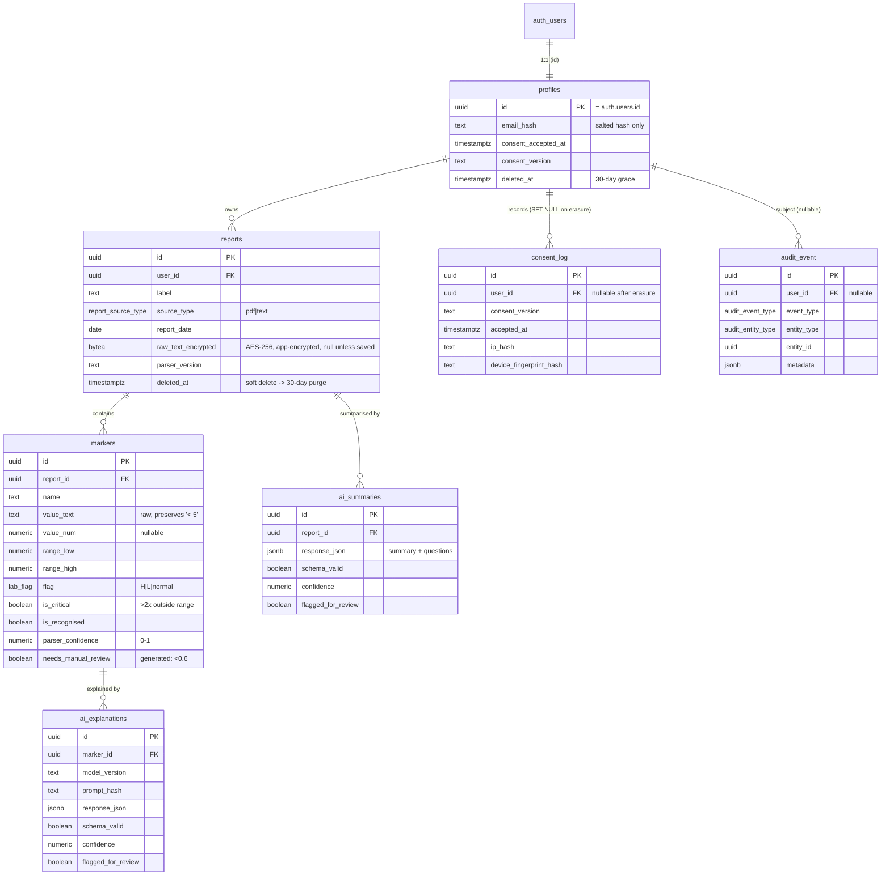

# Lab Results Explainer — Database Design

Database design for the **Lab Results Explainer** (PRD v1.0). Target: PostgreSQL 17
on Supabase (project `lab explainer results`, region `eu-central-1`).

Health data is treated as **special category data under UK GDPR Article 9**, which
drives the security and retention decisions throughout.

## How it maps to the PRD

The schema implements PRD **Section 6 (Data Model)** directly, with the privacy,
retention, and clinical-safety rules from **Sections 4, 6.2, and 7** enforced at
the database layer wherever practical (rather than relying on the app alone).

## Entity-relationship overview



## Tables

| Table | PRD entity | Purpose |
|-------|-----------|---------|
| `profiles` | user | App user, 1:1 with `auth.users`. PII minimised (email stored only as salted hash; real email lives in Supabase Auth). Holds current consent snapshot. |
| `reports` | report | A saved lab report. Raw text app-encrypted (AES-256) and persisted only when saved. Soft-delete + 30-day purge. Max 12 active per user. |
| `markers` | marker | One row per extracted marker. `value_text` preserves the raw value verbatim so non-numeric values like `< 5` survive; `value_num` is the numeric form when derivable. |
| `ai_explanations` | ai_explanation | Marker Explainer output (PRD 5.1). Stored only if the session is saved. |
| `ai_summaries` | ai_summary | Report Summariser + question list (PRD 5.2). Both outputs in one `response_json`. |
| `consent_log` | consent_log | Immutable, append-only consent history. 7-year retention; exempt from erasure. |
| `audit_event` | audit_event | Append-only operational audit trail. 3-year retention; not user-accessible. |

## Key design decisions

### Identity & PII minimisation
`profiles.id` is the `auth.users.id`. The real email never enters app tables —
only a salted `email_hash`. A trigger (`handle_new_user`) auto-creates a profile
row on signup; consent fields stay null until the consent gate is accepted.

### Marker values that aren't numbers (PRD 7.3)
Values like `< 5` or textual ranges are stored verbatim in `value_text` and never
dropped. `value_num` carries a numeric form only when one can be derived for
range comparison.

### Critical-value handling (PRD 7.1 / 7.3)
`markers.is_critical` flags values >2× outside range. The app suppresses the AI
explainer for these and signposts NHS 111. `needs_manual_review` is a *generated*
column (`parser_confidence < 0.6`) so the "review manually" rule can't drift from
the stored confidence.

### AI output persistence (PRD 6.1)
AI outputs are ephemeral by default and persisted only when the user saves the
session. `schema_valid` records whether the response passed JSON-schema
validation; `flagged_for_review` captures low-confidence / diagnostic-language
flags. The full structured response is kept in `response_json` (jsonb) for audit.

### Security — Row Level Security (UK GDPR Art. 9)
RLS is enabled on **every** table, default-deny:

- Users can reach only their own data, enforced via `auth.uid()` (directly or
  through the owning report).
- `audit_event` has RLS enabled with **no policies** — it is intentionally not
  user-accessible (PRD 6.2). Only the `service_role` key (server side, bypasses
  RLS) reads/writes it.
- `consent_log` allows insert + select of one's own rows; UPDATE/DELETE are
  blocked for everyone by triggers.

### Immutability of compliance records
`consent_log` and `audit_event` are append-only, enforced by `BEFORE` triggers.
For `consent_log`, a GUC-guarded trigger (`app.compliance_mode`) permits only the
trusted backend retention routines to anonymise/purge, while all normal traffic
is blocked.

### Retention & erasure (PRD 6.2) — automated with `pg_cron`
Daily jobs enforce each retention window:

| Job | Rule | Function |
|-----|------|----------|
| `purge-soft-deleted-reports` | soft-deleted reports purged after 30 days | `retention_purge_soft_deleted_reports()` |
| `purge-expired-reports` | reports/markers auto-purged at 24 months | `retention_purge_expired_reports()` |
| `purge-audit-events` | audit events purged after 3 years | `retention_purge_audit_events()` |
| `purge-consent-log` | consent log purged after 7 years | `retention_purge_consent_log()` |
| `purge-deleted-accounts` | account hard-deleted 30 days after request | `retention_purge_deleted_accounts()` |

**The consent-vs-erasure tension:** an account hard-delete must remove the
person's PII, but the consent record must survive 7 years. The resolution: account
erasure deletes the `auth.users` row (cascading to `profiles` and all health
data), and the consent FK is `ON DELETE SET NULL` — so the immutable consent fact
(version, timestamp, hashes) survives **anonymised**, with no link back to the
erased person. This satisfies both retention and erasure simultaneously.

## Security posture (Supabase advisors)

After migration, `get_advisors(security)` is clean except one **intentional**
INFO: `audit_event` has RLS enabled with no policy — by design (not
user-accessible). All `WARN` items (mutable `search_path`, public-callable
`SECURITY DEFINER` functions) were remediated in migration `09`.

## Applying the migrations

These migrations are already applied to the Supabase project. To reproduce on a
fresh project with the Supabase CLI:

```bash
supabase link --project-ref <ref>
supabase db push
```

Migrations are in `supabase/migrations/`, ordered by timestamp.

## Notes for the application layer

- **Encrypt before insert.** `reports.raw_text_encrypted` expects AES-256
  ciphertext produced by the app; the DB never sees plaintext report contents.
- **Write audit + ephemeral AI via the service role.** `audit_event` is not
  reachable with the anon/authenticated keys.
- **Hash IP / device fingerprint** before writing to `consent_log` (PRD 7.2).
- **Soft-delete, don't hard-delete, reports** from the client (set `deleted_at`);
  the 30-day purge job removes them permanently.
- The 12-report cap is enforced by trigger; the client should surface a friendly
  message on the resulting error.
